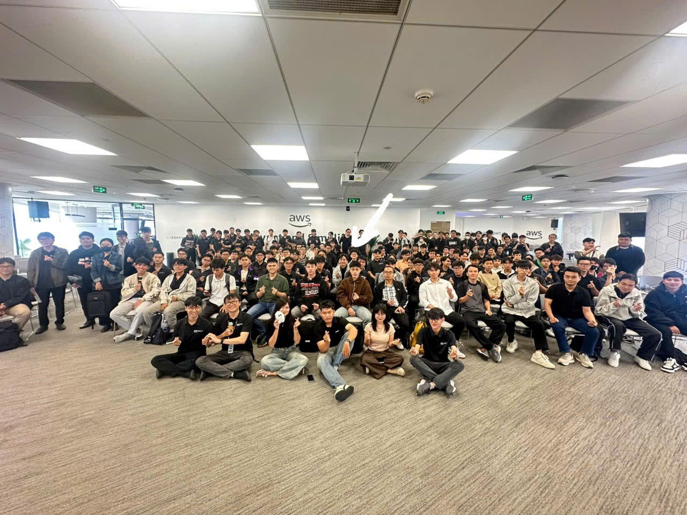

# Bài thu hoạch AWS Community Meetup

## Thông tin sự kiện

- **Tên sự kiện:** AWS Community Meetup
- **Thời gian:** Ngày 11/07/2026

## Giới thiệu sự kiện

Sự kiện là buổi gặp gỡ, giao lưu và chia sẻ kiến thức xoay quanh các chủ đề về bảo mật ứng dụng web, giám sát hệ thống (SLA & Monitoring) và định hướng học tập chinh phục chứng chỉ AWS Cloud Practitioner. Các diễn giả là những chuyên gia và thành viên tích cực từ cộng đồng AWS.

---

## Nội dung các phần chia sẻ

### 1. Securing Your Web Apps With AWS Security Agent

**Người chia sẻ:** Thinh Nguyen  
**Đến từ:** DevOps/DevSecOps/Cloud Engineer tại Styl Solutions

Nội dung chia sẻ tập trung vào giải pháp AWS Security Agent (Frontier Agent) được hỗ trợ bởi Amazon Bedrock, giúp tự động hóa quá trình bảo mật. Các tính năng nổi bật bao gồm:
- **Design Review:** Phân tích tài liệu kiến trúc trước khi viết code để đối chiếu với các tiêu chuẩn bảo mật (PCI DSS, NIST CSF, AWS Well-Architected).
- **Code Security Review:** Tự động quét các Pull Request trên GitHub/GitLab để tìm kiếm lỗ hổng và đề xuất mã vá lỗi (Auto-PR Fixes).
- **Automated Pentesting:** Thực hiện kiểm thử thâm nhập tự động và xác thực các phát hiện giống như một người dùng thực.

---

### 2. SLA and Monitoring - From SLA to Monitoring what really matters

**Người chia sẻ:** Nguyễn Huỳnh Sơn  
**Đến từ:** Thành viên AWS Student Builder Group HUFLIT

Bài trình bày nhấn mạnh thông điệp "Hạ tầng ổn định (Healthy Infrastructure) không đồng nghĩa với Trải nghiệm người dùng tốt (Happy Users)". Thay vì chỉ quan tâm đến các chỉ số máy chủ, chúng ta cần tập trung vào các số liệu kinh doanh và luồng người dùng (Customer Journey như Login, Checkout).
- Giới thiệu chu trình quản lý rủi ro: Nhận diện (Identify) -> Giám sát (Monitor) -> Phản hồi (Respond) -> Cải thiện (Improve).
- Đưa ra ví dụ thực tế về việc thiết lập CloudWatch Alarms và SNS Topic fan-out để cảnh báo ngay khi các chỉ số (ví dụ: Login Failure) vượt ngưỡng.

---

### 3. Inside The Exam: AWS Cloud Practitioner

**Người chia sẻ:** Ngo Le Tan Huy  

Diễn giả cung cấp một lộ trình chiến lược để chinh phục kỳ thi AWS Cloud Practitioner (CLF-C02), bao gồm:
- **Thông tin bài thi:** Gồm 65 câu trắc nghiệm trong 90 phút, bao trùm 4 lĩnh vực (Cloud Concepts, Security and Compliance, Cloud Technology and Services, Billing).
- **Phương pháp học:** Gắn kết dịch vụ với từ khóa (Map Keyword Thinking), phân tích kỹ các lỗi sai khi làm bài thi thử (Review Mistakes), và thực hành trực tiếp trên AWS Free Tier.
- **Tips & Tricks làm bài:** Sử dụng kỹ năng loại trừ, không nghĩ quá phức tạp (Don't overthink), cảnh giác với các từ khóa bẫy trong tiếng Anh, và biết cách gắn cờ (flag) những câu khó để xem lại sau.

---

## Những điều học được

- Hiểu rõ hơn về các công cụ bảo mật tự động hóa và vai trò của AI trong DevSecOps với AWS Security Agent.
- Có tư duy đúng đắn hơn về Monitoring: luôn đặt trải nghiệm của người dùng lên hàng đầu khi thiết lập hệ thống giám sát và SLA.
- Nắm bắt được cấu trúc, chiến thuật ôn tập và các mẹo hữu ích để chuẩn bị thật tốt cho kỳ thi chứng chỉ AWS Cloud Practitioner.

---

## Hình ảnh tham gia sự kiện

