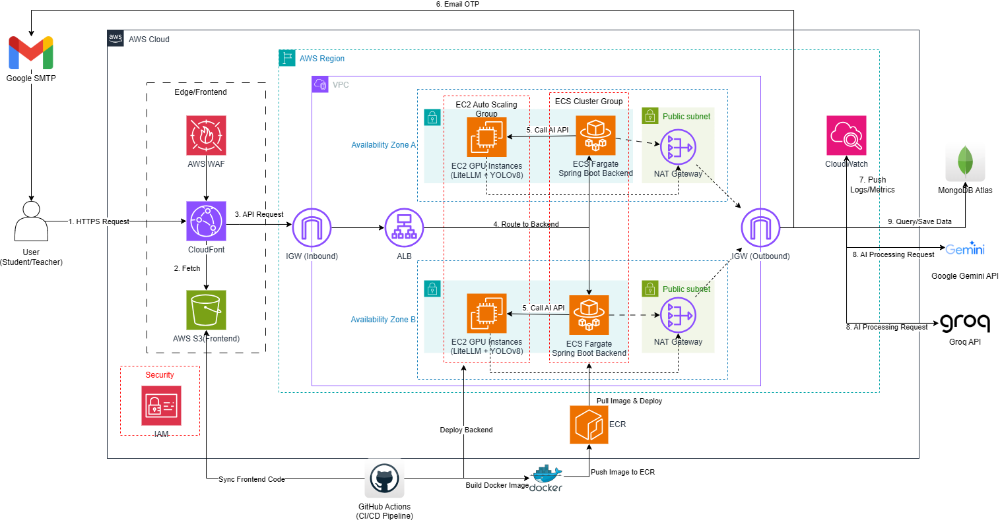

---
title: "Practical Deployment (Workshop)"
date: 2024-01-01
weight: 6
chapter: false
pre: " <b> 6. </b> "
---

# AuraAcademic AWS Deployment Guide (Step-by-Step)

#### Overview

In this section, we will practice deploying the entire **AuraAcademic** system architecture to the actual Amazon Web Services (AWS) cloud computing environment.

**Architecture Diagram: AuraAcademic System Deployment on AWS**

**Important Note on Deployment Architecture (Cost-Optimized vs Enterprise):**
- **Architecture Diagram (Enterprise):** In the theoretical design, we use **Private Subnets** and **NAT Gateways** to ensure maximum security (High Security & High Availability).
- **Practical Deployment (Cost-Optimized):** Since NAT Gateways have a very high maintenance cost (~$86/month), in this workshop, we will apply a **Cost-Optimized Architecture for students**. The ECS and EC2 servers will be placed in **Public Subnets** and strictly protected by **Security Groups (Firewalls)**. This approach helps you complete your project excellently with a maintenance cost of only about $30-$50/month (or even less than $10 using Spot Instances).

#### Workshop Content

The deployment process is divided into 7 main stages:

1. [Stage 1: IAM & Security](6.1-iam-security/) - Create accounts and grant permissions for GitHub Actions, ECS.
2. [Stage 2: VPC Network](6.2-vpc-network/) - Build a cost-optimized Public Subnet architecture and Routing.
3. [Stage 3: ECS Backend](6.3-ecs-backend/) - Deploy the Spring Boot API to Serverless Containers.
4. [Stage 4: EC2 GPU AI](6.4-ec2-gpu-ai/) - Install the VM running YOLOv8 and LiteLLM for WebSockets processing.
5. [Stage 5: S3 & CloudFront Frontend](6.5-s3-cloudfront-frontend/) - Host static web files and global CDN.
6. [Stage 6: CI/CD GitHub Actions](6.6-cicd-github/) - Integrate automated code deployment pipeline.
7. [Resource Cleanup](6.7-cleanup/) - Guide to deleting services to avoid incurring costs.

> **Note:** Get your AWS account ready and let's go step-by-step!

